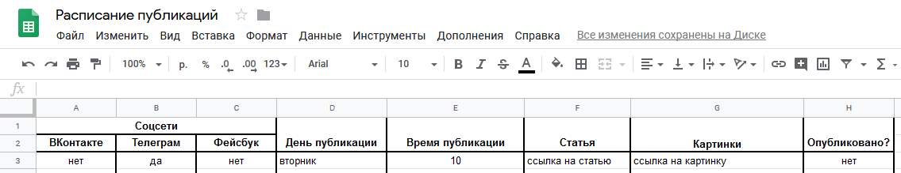

# Публикация постов по расписанию

Проект предназначен для публикации постов в социальные сети по расписанию. План постинга оформляется с помощью [Таблиц Google](https://docs.google.com/spreadsheets). Текст и фото публикаций загружаются в [Google Drive](https://drive.google.com).

Поддерживаемые соцсети:
- Вконтакте
- Facebook
- Telegram

Да, это smm planner на минималках.

### Как установить

1. Python3 должен быть уже установлен.  
2. Используйте `pip` (или `pip3`, есть конфликт с Python2) для установки зависимостей:
```
pip install -r requirements.txt
```
3. Рекомендуется использовать [virtualenv/venv](https://docs.python.org/3/library/venv.html) для изоляции проекта.

4. Создать google таблицу с планом по шаблону и занести её `id` (найти его можно в url страницы) в файл `.env` под именем `SPREADSHEET_ID`.



5. Создать проект и получить к нему `credentials.json` [здесь](https://developers.google.com/sheets/api/quickstart/python) (Step 1). Полученный файл положить в папку с программой.

6. Получить файл `client_secrets.json` для вашего проекта [здесь](https://gsuitedevs.github.io/PyDrive/docs/build/html/quickstart.html#authentication) (Authentication). Полученный файл с правильным именем положить в папку с программой.

7. Для работы с Api Вконтакте требуется: 
    * `Access Token`, чтобы его получить:
        * Зарегистрируйте Standalone-приложение на [vk.com/dev](https://vk.com/dev)
        * Получите ключ доступа пользователя с помощью процедуры [Implict Flow](https://vk.com/dev/implicit_flow_user). Потребуются права: photos, groups, wall и offline
        * Полученный ключ следует положить в файл `.env` под именем `VK_ACCESS_TOKEN`.
    * `id альбома` и `id группы` Вконтакте, в которой будет публиковаться запись. Они кладутся в файл `.env` под именами `VK_ALBUM_ID` и `VK_GROUP_ID` соответственно. Узнать `id группы` можно [здесь](http://regvk.com/id/).

8. Для работы с Telegram потребуется:
    * Включить `VPN`, если мессенджер заблокирован в вашей стране 
    * Получить `bot token` и положить его в `.env` под именем `TG_BOT_TOKEN`, об этом [здесь](https://smmplanner.com/blog/otlozhennyj-posting-v-telegram/)
    * Добавить имя канала  в `.env` в виде `@chanel_name` под именем `TG_CHAT_URL`.

9. Для работы с Facebook потребуется:
    * `User Access Token` с правом `publish_to_groups`, проще получить его с помощью [Graph API Explorer](https://developers.facebook.com/tools/explorer/). Полученный токен положить в `.env`, имя `FB_TOKEN`. Руководство по GAE [тут](https://developers.facebook.com/docs/graph-api/explorer/). Продление токена с 2 часов до 2 месяцев [тут](https://developers.facebook.com/tools/debug/accesstoken/)
    * `id группы` Facebook, в которой будет публиковаться запись. Занести в `.env`, имя `FB_GROUP_ID`.

10. Запустите файл `check_spreadsheet.py`.

### Важно знать

1. При первом запуске откроется окно браузера для предоставления прав доступа программе, разрешить доступ нужно вручную.
2. Программа ищет посты в таблице, которые пора опубликовать, каждые 5 минут.
3. При нахождении подходящего поста, откроется окно браузера и автоматически пройдет аутентификация в сервисе Google Drive.
4. Программа работает в бесконечном цикле, прерывание - комбинацией `Ctrl + C`.

### Цель проекта

Код написан в образовательных целях на онлайн-курсе для веб-разработчиков [dvmn.org](https://dvmn.org/).
